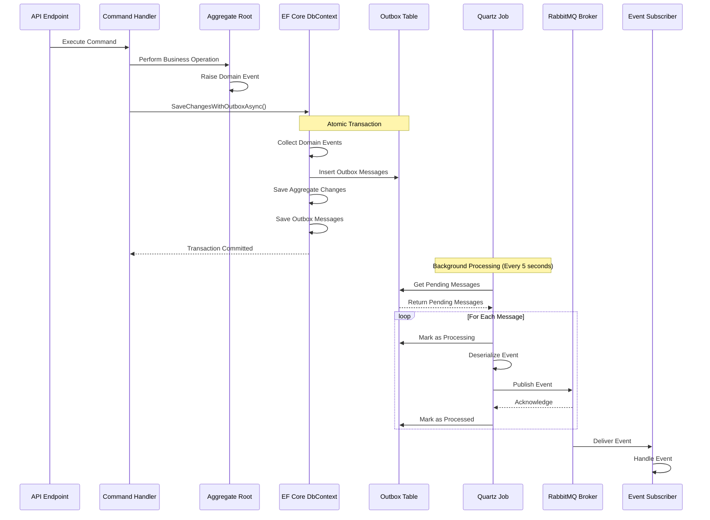

# Transactional Outbox Pattern - Implementation Documentation

## Overview
The Transactional Outbox Pattern ensures reliable event publication in a distributed system. When a domain event is raised, it is saved to an outbox table within the same database transaction as the aggregate changes, guaranteeing that events are never lost even if the message broker is temporarily unavailable.

## Architecture Diagram



## Implementation Details

### 1. Outbox Table Structure

The outbox table (`OutboxMessage`) contains:
- **Id**: Unique identifier (Guid)
- **EventType**: Fully qualified type name of the domain event
- **Payload**: JSON serialized domain event
- **Status**: Current status (Pending, Processing, Processed, Failed)
- **CreatedAt**: Timestamp when event was created
- **ProcessedAt**: Timestamp when event was processed
- **RetryCount**: Number of retry attempts
- **Error**: Error message if processing failed

### 2. Atomic Transaction

**Location:** `FarmManagement.Infrastructure.Shared/Persistence/Extensions/DbContextExtensions.cs`

```csharp
public static async Task SaveChangesWithOutboxAsync(
    this BaseDbContext context,
    CancellationToken cancellationToken = default)
{
    // 1. Collect domain events BEFORE saving
    var domainEvents = context.ChangeTracker
        .Entries<AggregateRoot>()
        .SelectMany(e => e.Entity.DomainEvents)
        .ToList();

    // 2. Convert to outbox messages
    foreach (var domainEvent in domainEvents)
    {
        var outboxMessage = new OutboxMessage
        {
            Id = Guid.NewGuid(),
            EventType = domainEvent.GetType().AssemblyQualifiedName,
            Payload = JsonSerializer.Serialize(domainEvent),
            Status = OutboxMessageStatus.Pending,
            RetryCount = 0,
            CreatedAt = DateTime.UtcNow
        };
        context.Set<OutboxMessage>().Add(outboxMessage);
    }

    // 3. Clear domain events from aggregates
    foreach (var entry in context.ChangeTracker.Entries<AggregateRoot>())
    {
        entry.Entity.ClearDomainEvents();
    }

    // 4. Save everything atomically in ONE transaction
    await context.SaveChangesAsync(cancellationToken);
}
```

**Key Points:**
- All changes (aggregate + outbox) are saved in a single database transaction
- If the transaction fails, nothing is persisted
- If the transaction succeeds, both aggregate and events are guaranteed to be saved

### 3. Background Processing

**Location:** `FarmManagement.Infrastructure.Shared/Background/Jobs/OutboxProcessorJob.cs`

The Quartz.NET job runs periodically (default: every 5 seconds) to:
1. Retrieve pending messages from the outbox
2. Mark messages as "Processing"
3. Deserialize and publish to RabbitMQ
4. Mark as "Processed" on success
5. Handle retries on failure

### 4. Retry Mechanism

**Configuration:** `OutboxOptions`
- **MaxRetryAttempts**: 3 (default)
- **RetryDelaySeconds**: 10 (default)
- **BatchSize**: 50 messages per processing cycle
- **IntervalSeconds**: 5 seconds between processing cycles

**Retry Logic:**
```csharp
try
{
    await _eventPublisher.PublishAsync(integrationEvent, cancellationToken);
    await _outboxRepository.MarkAsProcessedAsync(message.Id, cancellationToken);
}
catch (Exception ex)
{
    await _outboxRepository.IncrementRetryCountAsync(message.Id, cancellationToken);
    
    if (newRetryCount >= _options.MaxRetryAttempts)
    {
        await _outboxRepository.MarkAsFailedAsync(message.Id, ex.Message, cancellationToken);
    }
    else
    {
        await _outboxRepository.ResetToPendingAsync(message.Id, cancellationToken);
    }
}
```

**Retry Flow:**
1. On failure, increment retry count
2. If retry count < max attempts: Reset to "Pending" for next cycle
3. If retry count >= max attempts: Mark as "Failed" (requires manual intervention)

### 5. Message Status Lifecycle

```
Pending → Processing → Processed
   ↓
Failed (after max retries)
```

- **Pending**: Newly created, waiting to be processed
- **Processing**: Currently being published to RabbitMQ
- **Processed**: Successfully published and acknowledged
- **Failed**: Exceeded max retry attempts, requires manual review

## Guarantees

### ✅ At-Least-Once Delivery
- Events are retried until successfully published or marked as failed
- No events are lost if the broker is temporarily down

### ✅ Transactional Consistency
- Aggregate changes and event publication are atomic
- Either both succeed or both fail

### ✅ Idempotency
- Event handlers must be idempotent (handle duplicate events gracefully)
- Event IDs can be used to detect duplicates

## Configuration

**appsettings.json:**
```json
{
  "Outbox": {
    "BatchSize": 50,
    "IntervalSeconds": 5,
    "MaxRetryAttempts": 3,
    "RetryDelaySeconds": 10
  },
  "RabbitMQ": {
    "HostName": "localhost",
    "Port": 5672,
    "UserName": "guest",
    "Password": "guest",
    "ExchangeName": "farmwise.events",
    "ExchangeType": "topic"
  }
}
```

## Monitoring

### Key Metrics
- Number of pending messages
- Number of failed messages
- Average processing time
- Retry count distribution

### Health Checks
- Monitor outbox table for stuck messages (Processing status > 5 minutes)
- Alert on high failure rates
- Track message processing latency

## Failure Scenarios

### Scenario 1: RabbitMQ Down
- **Behavior**: Messages remain in "Pending" status
- **Recovery**: When RabbitMQ comes back, messages are automatically processed
- **Guarantee**: No events are lost

### Scenario 2: Deserialization Failure
- **Behavior**: Message marked as "Failed" immediately
- **Action**: Requires code fix and manual reprocessing

### Scenario 3: Network Timeout
- **Behavior**: Retry up to MaxRetryAttempts
- **Recovery**: Automatic retry on next processing cycle

### Scenario 4: Database Transaction Failure
- **Behavior**: Entire transaction rolls back (aggregate + outbox)
- **Guarantee**: No partial state persisted

## Best Practices

1. **Keep Events Small**: Large payloads increase processing time
2. **Use Idempotent Handlers**: Events may be delivered multiple times
3. **Monitor Failed Messages**: Set up alerts for failed message count
4. **Tune Batch Size**: Balance between throughput and memory usage
5. **Regular Cleanup**: Archive processed messages older than retention period

## Testing

### Unit Tests
- Test atomic transaction behavior
- Test retry logic
- Test status transitions

### Integration Tests
- Test end-to-end event flow
- Test failure scenarios
- Test broker availability handling

## Future Enhancements

1. **Dead Letter Queue**: Move failed messages to DLQ for analysis
2. **Event Sourcing**: Use outbox as event store
3. **Partitioning**: Partition outbox by module for scalability
4. **Compression**: Compress large event payloads
5. **Metrics Export**: Export metrics to monitoring system
