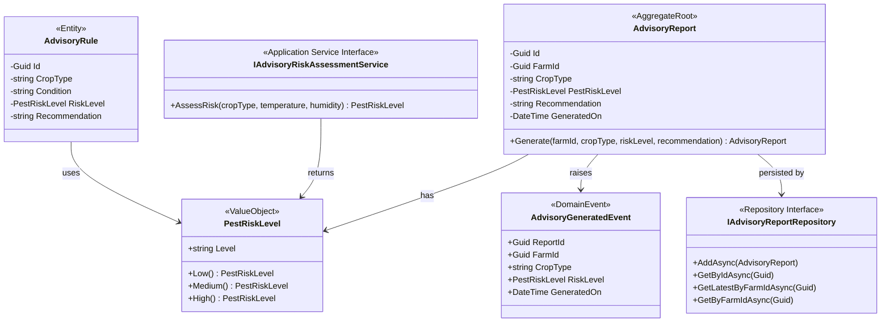

# Advisory Bounded Context - Class Diagram

## Overview
The Advisory Bounded Context provides pest risk assessment and generates advisory reports for farms.

## Class Diagram

## Components

### Aggregate Root
- **AdvisoryReport**: Main aggregate root representing a generated advisory report

### Entities
- **AdvisoryRule**: Entity containing business rules for risk assessment

### Value Objects
- **PestRiskLevel**: Immutable value object representing risk levels (Low, Medium, High)

### Domain Events
- **AdvisoryGeneratedEvent**: Raised when a new advisory report is generated

### Repository
- **IAdvisoryReportRepository**: Repository interface for advisory report persistence

### Application Services
- **IAdvisoryRiskAssessmentService**: Service interface for risk assessment logic (implemented in Infrastructure layer)

## Business Rules
1. AdvisoryReport must be associated with a valid FarmId
2. PestRiskLevel must be one of: Low, Medium, or High
3. Recommendation must be provided for each report
4. Reports are generated based on crop type, temperature, and humidity
5. Latest report per farm can be retrieved for current recommendations

## Integration Points
- **Crop Bounded Context**: Listens to CropCycleStarted events to auto-generate reports
- **Farm Bounded Context**: References FarmId for report association

## Risk Assessment Logic
The risk assessment service uses rule-based logic:
- **High Risk**: Maize crops with temperature > 25°C and humidity > 70%
- **Medium Risk**: Any crop with humidity > 60%
- **Low Risk**: All other conditions
