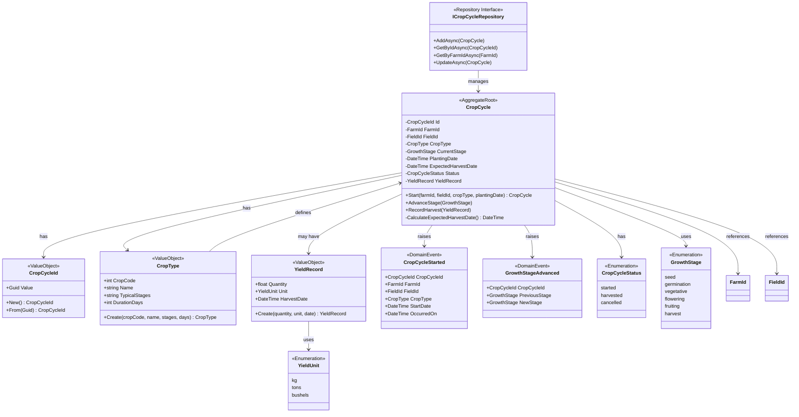

# Crop Bounded Context - Class Diagram

## Overview
The Crop Bounded Context manages crop cycles, growth stages, and harvest records.

## Class Diagram

## Components

### Aggregate Root
- **CropCycle**: Main aggregate root managing the complete lifecycle of a crop from planting to harvest

### Value Objects
- **CropCycleId**: Unique identifier for crop cycles
- **CropType**: Immutable value object defining crop characteristics (code, name, stages, duration)
- **YieldRecord**: Immutable value object recording harvest data (quantity, unit, date)
- **FarmId**: Reference to farm (from SharedKernel)
- **FieldId**: Reference to field (from SharedKernel)

### Domain Events
- **CropCycleStarted**: Raised when a new crop cycle begins
- **GrowthStageAdvanced**: Raised when crop progresses to next growth stage

### Enumerations
- **CropCycleStatus**: Status of the crop cycle (started, harvested, cancelled)
- **GrowthStage**: Stages of crop growth (seed, germination, vegetative, flowering, fruiting, harvest)
- **YieldUnit**: Units for measuring yield (kg, tons, bushels)

### Repository
- **ICropCycleRepository**: Repository interface for crop cycle persistence

## Business Rules
1. A CropCycle must have a valid FarmId and FieldId
2. CropCycle can only advance stages if status is "started"
3. Harvest can only be recorded once per cycle
4. Expected harvest date is calculated based on CropType duration
5. CropType must be defined by Admin role (RBAC requirement)
6. YieldRecord cannot have future harvest dates
7. YieldRecord quantity must be greater than zero

## Integration Points
- **Farm Bounded Context**: References FarmId and FieldId
- **Advisory Bounded Context**: CropCycleStarted event triggers advisory report generation
