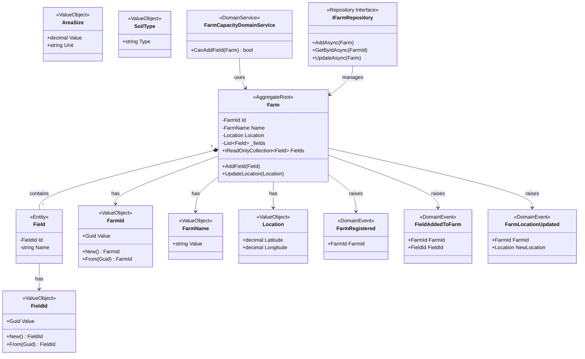

# Farm Bounded Context - Class Diagram

## Overview
The Farm Bounded Context manages farm registration, field management, and location tracking.

## Class Diagram

## Components

### Aggregate Root
- **Farm**: Main aggregate root that manages farm consistency boundaries

### Entities
- **Field**: Entity within the Farm aggregate

### Value Objects
- **FarmId**: Unique identifier for farms
- **FarmName**: Farm name value object
- **Location**: Geographic coordinates (Latitude, Longitude)
- **FieldId**: Unique identifier for fields
- **AreaSize**: Field area measurement
- **SoilType**: Soil classification

### Domain Events
- **FarmRegistered**: Raised when a new farm is registered
- **FieldAddedToFarm**: Raised when a field is added to a farm
- **FarmLocationUpdated**: Raised when farm location is updated

### Domain Services
- **FarmCapacityDomainService**: Business logic for determining if a farm can add more fields

### Repository
- **IFarmRepository**: Repository interface for farm persistence

## Business Rules
1. A Farm must have a unique FarmId
2. A Farm must have a valid Location (coordinates)
3. A Farm can contain multiple Fields
4. Fields are managed through the Farm aggregate root
5. Farm capacity is enforced through domain service (max 100 fields)
